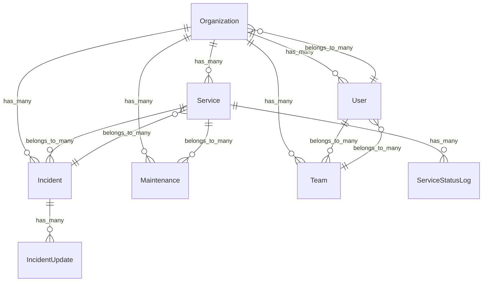

# Architecture Overview

This document provides a comprehensive overview of the Plivo Status application architecture, design patterns, and technical decisions.

## System Architecture

### High-Level Overview

The application follows a modern web application architecture with the following layers:

```
┌─────────────────────────────────────────────────────────────┐
│                    Frontend (React + TypeScript)            │
├─────────────────────────────────────────────────────────────┤
│                    Inertia.js Bridge                        │
├─────────────────────────────────────────────────────────────┤
│                    Laravel Backend                          │
├─────────────────────────────────────────────────────────────┤
│                    Database Layer                           │
└─────────────────────────────────────────────────────────────┘
```

### Technology Stack

#### Backend (Laravel 12)
- **Framework**: Laravel 12 with modern PHP 8.2+ features
- **Database**: MySQL/PostgreSQL with Eloquent ORM
- **Authentication**: Laravel Sanctum with session-based auth
- **Real-time**: Pusher/Laravel Reverb for WebSocket communication
- **Queue**: Laravel Queue for background processing
- **Caching**: Redis/File-based caching

#### Frontend (React 19)
- **Framework**: React 19 with TypeScript
- **Build Tool**: Vite for fast development and building
- **Styling**: Tailwind CSS 4 with ShadcnUI components
- **State Management**: React hooks and Inertia.js
- **Real-time**: Laravel Echo with Pusher.js

#### Development Tools
- **Code Quality**: ESLint, Prettier, Laravel Pint
- **Testing**: PHPUnit, React Testing Library
- **Type Safety**: TypeScript for frontend, PHP type hints

## Design Patterns

### 1. Multi-Tenant Architecture

The application implements a multi-tenant architecture where each organization operates in isolation:

```php
// Organization context middleware
class OrganizationContext
{
    public function handle($request, $next)
    {
        $organization = $this->resolveOrganization($request);
        app()->instance(Organization::class, $organization);
        return $next($request);
    }
}
```

#### Tenant Isolation
- **Database**: Shared database with organization_id foreign keys
- **Middleware**: Organization context middleware for route isolation
- **Policies**: Organization-scoped authorization policies

### 2. Repository Pattern

Business logic is separated into service classes:

```php
class PermissionService
{
    public function userHasOrganizationPermission(User $user, Organization $organization, string $permission): bool
    {
        // Permission logic implementation
    }
}
```

### 3. Event-Driven Architecture

Real-time updates are handled through Laravel events:

```php
class ServiceStatusChanged implements ShouldBroadcast
{
    public function broadcastOn(): array
    {
        return [
            new Channel("organization.{$this->service->organization_id}"),
        ];
    }
}
```

### 4. Policy-Based Authorization

Fine-grained permissions using Laravel policies:

```php
class ServicePolicy
{
    public function update(User $user, Service $service): bool
    {
        return $user->can('manage_services', $service->organization);
    }
}
```

## Database Design

### Core Tables

#### Organizations
```sql
organizations
├── id (primary key)
├── name
├── slug (unique)
├── domain
├── settings (JSON)
├── created_at
└── updated_at
```

#### Users & Relationships
```sql
users
├── id (primary key)
├── name
├── email (unique)
├── password
├── is_system_admin
└── email_verified_at

organization_user (pivot)
├── organization_id (FK)
├── user_id (FK)
├── role (enum)
├── permissions (JSON)
└── is_active

team_user (pivot)
├── team_id (FK)
├── user_id (FK)
├── role (enum)
├── permissions (JSON)
└── created_at
```

#### Services & Status
```sql
services
├── id (primary key)
├── organization_id (FK)
├── name
├── description
├── status (enum)
├── category
└── settings (JSON)

service_status_logs
├── id (primary key)
├── service_id (FK)
├── status (enum)
├── message
└── created_at
```

#### Incidents & Maintenance
```sql
incidents
├── id (primary key)
├── organization_id (FK)
├── title
├── description
├── severity (enum)
├── status (enum)
└── resolved_at

incident_updates
├── id (primary key)
├── incident_id (FK)
├── message
├── status (enum)
└── created_at

maintenances
├── id (primary key)
├── organization_id (FK)
├── title
├── description
├── scheduled_at
├── duration_minutes
└── status (enum)
```

### Relationships



## Frontend Architecture

### Component Structure

```
resources/js/
├── components/           # Reusable UI components
│   ├── ui/              # ShadcnUI components
│   ├── app-*.tsx        # App-specific components
│   └── *.tsx            # Feature components
├── pages/               # Inertia.js pages
│   ├── auth/           # Authentication pages
│   ├── dashboard/      # Dashboard pages
│   ├── services/       # Service management
│   ├── incidents/      # Incident management
│   └── settings/       # Settings pages
├── hooks/              # Custom React hooks
├── types/              # TypeScript type definitions
└── lib/                # Utility functions
```

### State Management

The application uses a combination of:

1. **Inertia.js**: Server-side state management
2. **React Hooks**: Local component state
3. **Laravel Echo**: Real-time state updates

```typescript
// Custom hook for permissions
export function usePermissions() {
    const { auth } = usePage<SharedData>().props;
    
    return {
        hasOrganizationPermission: (permission: string) => 
            auth.currentPermissions?.organization?.[permission] ?? false,
        hasTeamPermission: (permission: string) => 
            auth.currentPermissions?.team?.[permission] ?? false,
    };
}
```

### Real-time Updates

Real-time features are implemented using Laravel Echo:

```typescript
// Real-time hook
export function useRealtime() {
    useEffect(() => {
        Echo.channel(`organization.${organizationId}`)
            .listen('ServiceStatusChanged', (e) => {
                // Update service status
            })
            .listen('IncidentCreated', (e) => {
                // Add new incident
            });
    }, [organizationId]);
}
```

## Security Architecture

### Authentication

- **Session-based**: Laravel's built-in session authentication
- **CSRF Protection**: Automatic CSRF token validation
- **Rate Limiting**: API rate limiting for sensitive endpoints

### Authorization

- **Role-based**: Organization and team roles
- **Permission-based**: Granular permissions with custom overrides
- **Policy-based**: Laravel policies for model authorization

### Data Protection

- **Tenant Isolation**: Organization-scoped data access
- **Input Validation**: Laravel form requests and validation
- **SQL Injection**: Eloquent ORM protection
- **XSS Protection**: Automatic output escaping

## Performance Considerations

### Caching Strategy

```php
// Permission caching
class PermissionService
{
    public function getUserOrganizationPermissions(User $user, Organization $organization): array
    {
        return Cache::remember(
            "user_permissions_{$user->id}_{$organization->id}",
            now()->addMinutes(30),
            fn() => $this->calculatePermissions($user, $organization)
        );
    }
}
```

### Database Optimization

- **Indexes**: Strategic database indexes on foreign keys and frequently queried columns
- **Eager Loading**: Eloquent relationships loaded efficiently
- **Query Optimization**: Optimized queries with proper joins

### Frontend Performance

- **Code Splitting**: Vite automatic code splitting
- **Lazy Loading**: React.lazy for route-based code splitting
- **Asset Optimization**: Vite build optimization

## Scalability

### Horizontal Scaling

- **Stateless**: Laravel sessions can be shared across servers
- **Queue Workers**: Background jobs can be distributed
- **Database**: Read replicas for read-heavy operations

### Vertical Scaling

- **Caching**: Redis for session and cache storage
- **CDN**: Static assets served via CDN
- **Database**: Connection pooling and query optimization

## Monitoring & Observability

### Logging

- **Application Logs**: Laravel's built-in logging
- **Error Tracking**: Exception handling and reporting
- **Performance Monitoring**: Query and request timing

### Health Checks

```php
// Health check endpoint
Route::get('/health', function () {
    return response()->json([
        'status' => 'healthy',
        'timestamp' => now(),
        'database' => DB::connection()->getPdo() ? 'connected' : 'disconnected',
    ]);
});
```

## Development Workflow

### Code Organization

```
app/
├── Console/Commands/     # Artisan commands
├── Enums/               # PHP enums for type safety
├── Events/              # Event classes
├── Http/
│   ├── Controllers/     # Request handling
│   ├── Middleware/      # Request middleware
│   ├── Requests/        # Form validation
│   └── Resources/       # API resources
├── Listeners/           # Event listeners
├── Models/              # Eloquent models
├── Notifications/       # Notification classes
├── Policies/            # Authorization policies
├── Providers/           # Service providers
└── Services/            # Business logic
```

### Testing Strategy

- **Unit Tests**: Individual component testing
- **Feature Tests**: End-to-end functionality testing
- **Integration Tests**: API and database integration
- **Frontend Tests**: React component testing

## Deployment Architecture

### Production Environment

```
┌─────────────────┐    ┌─────────────────┐    ┌─────────────────┐
│   Load Balancer │    │   Web Server 1  │    │   Web Server 2  │
│   (Nginx)       │────│   (Laravel)     │    │   (Laravel)     │
└─────────────────┘    └─────────────────┘    └─────────────────┘
                                │                       │
                                └───────────────────────┘
                                           │
                                ┌─────────────────┐
                                │   Database      │
                                │   (MySQL)       │
                                └─────────────────┘
                                           │
                                ┌─────────────────┐
                                │   Redis         │
                                │   (Cache/Queue) │
                                └─────────────────┘
```

### Environment Configuration

- **Development**: Local development with hot reloading
- **Staging**: Production-like environment for testing
- **Production**: Optimized for performance and security

## Future Considerations

### Planned Enhancements

1. **Microservices**: Potential migration to microservices architecture
2. **GraphQL**: API modernization with GraphQL
3. **Real-time Analytics**: Advanced analytics and reporting
4. **Mobile App**: Native mobile application
5. **API Rate Limiting**: Advanced API management
6. **Webhooks**: External service integrations

### Technical Debt

- **Legacy Code**: Refactoring opportunities in older components
- **Performance**: Continuous optimization of database queries
- **Security**: Regular security audits and updates
- **Documentation**: Keeping documentation up to date

This architecture provides a solid foundation for a scalable, maintainable, and secure status page application while allowing for future growth and enhancements. 