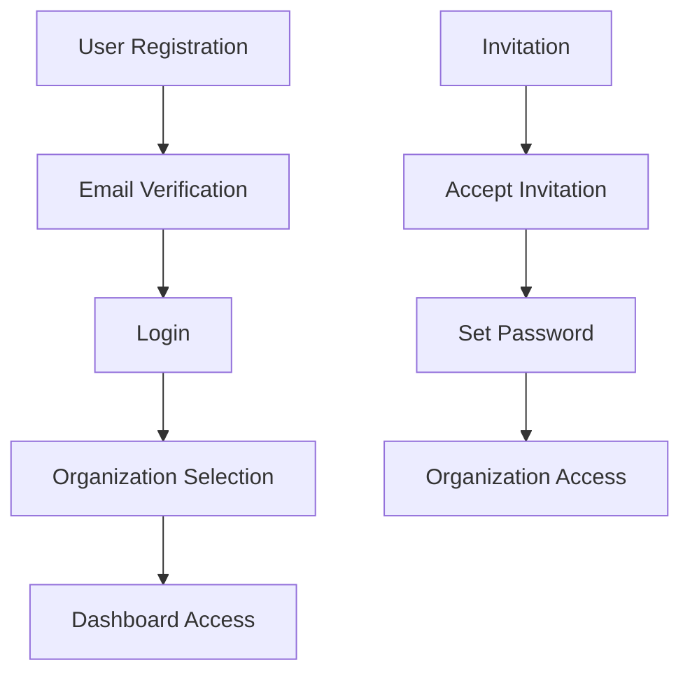

# Authentication & Permissions

This document covers the authentication system, user management, roles, and permissions in the Plivo Status application.

## Authentication System

### Overview

The application uses Laravel's built-in authentication system with session-based authentication and email verification.

### Authentication Flow



### Registration Process

1. **User Registration**
   ```php
   // Registration controller
   class RegisteredUserController extends Controller
   {
       public function store(RegisterRequest $request)
       {
           $user = User::create($request->validated());
           event(new Registered($user));
           Auth::login($user);
           return redirect()->intended('/dashboard');
       }
   }
   ```

2. **Email Verification**
   - Automatic email verification workflow
   - Users must verify email before accessing protected features
   - Resend verification email functionality

3. **Password Reset**
   - Secure password reset via email
   - Token-based reset mechanism
   - Password confirmation requirements

## User Management

### User Model

```php
class User extends Authenticatable
{
    protected $fillable = [
        'name',
        'email',
        'password',
        'is_system_admin',
    ];

    protected $hidden = [
        'password',
        'remember_token',
    ];

    protected $casts = [
        'email_verified_at' => 'datetime',
        'is_system_admin' => 'boolean',
    ];
}
```

### System Admin

System admins have access to all organizations and administrative features:

```php
// Check if user is system admin
if ($user->isSystemAdmin()) {
    // Full access to all organizations
}

// Grant system admin status
$user->grantSystemAdmin();

// Remove system admin status
$user->removeSystemAdmin();
```

## Multi-Tenant Organization System

### Organization Membership

Users can belong to multiple organizations with different roles:

```php
// Organization relationship
class User extends Authenticatable
{
    public function organizations()
    {
        return $this->belongsToMany(Organization::class, 'organization_user')
            ->withPivot(['role', 'permissions', 'is_active'])
            ->withTimestamps();
    }
}
```

### Organization Context

The application uses middleware to establish organization context:

```php
class OrganizationContext
{
    public function handle($request, $next)
    {
        $organization = $this->resolveOrganization($request);
        
        if (!$organization) {
            return redirect()->route('organizations.select');
        }
        
        app()->instance(Organization::class, $organization);
        return $next($request);
    }
}
```

## Role-Based Access Control

### Organization Roles

| Role | Description | Default Permissions |
|------|-------------|-------------------|
| `owner` | Full organization control | All permissions enabled |
| `admin` | Full organization control | All permissions enabled |
| `team_lead` | Team management | `manage_teams`, `manage_services`, `manage_incidents`, `manage_maintenance`, `view_analytics` |
| `member` | Basic access | No management permissions |

### Team Roles

| Role | Description | Default Permissions |
|------|-------------|-------------------|
| `lead` | Team management | `manage_teams`, `manage_services`, `manage_incidents`, `manage_maintenance`, `view_analytics` |
| `member` | Team member | `manage_incidents`, `manage_maintenance` |

### Permission System

#### Available Permissions

| Permission | Description | Scope |
|------------|-------------|-------|
| `manage_organization` | Update organization settings, branding, configuration | Organization |
| `manage_users` | Invite, remove, manage user roles and permissions | Organization |
| `manage_teams` | Create, edit, delete teams and assign team members | Both |
| `manage_services` | Create, edit, delete services and update their status | Both |
| `manage_incidents` | Create, update, and resolve incidents | Both |
| `manage_maintenance` | Schedule and manage maintenance windows | Both |
| `view_analytics` | Access analytics and reporting features | Both |

#### Permission Resolution

The permission system follows this hierarchy:

1. **System Admin**: Has access to everything
2. **Organization Permission**: If user has organization-level permission, they can access all resources
3. **Team Permission**: If user has team-level permission, they can access team-specific resources
4. **Final Permission**: Organization permission OR Team permission (whichever grants access)

```php
class PermissionService
{
    public function userCan(User $user, string $permission, Organization $organization, ?Team $team = null): bool
    {
        // System admin check
        if ($user->isSystemAdmin()) {
            return true;
        }
        
        // Organization permission check
        if ($this->userHasOrganizationPermission($user, $organization, $permission)) {
            return true;
        }
        
        // Team permission check
        if ($team && $this->userHasTeamPermission($user, $team, $permission)) {
            return true;
        }
        
        return false;
    }
}
```

## Custom Permissions

### Overview

The application supports custom permissions that can override default role permissions at both organization and team levels.

### Custom Permission Management

```php
// Update organization role permissions
$permissionService->updateOrganizationRolePermissions(
    $organization, 
    'member', 
    ['manage_services' => true, 'manage_incidents' => true]
);

// Update team role permissions
$permissionService->updateTeamRolePermissions(
    $team, 
    'member', 
    ['manage_services' => true, 'view_analytics' => true]
);
```

### Permission Storage

Custom permissions are stored in JSON columns:

```sql
-- organization_user table
permissions (JSON) - Custom permissions for organization role

-- team_user table
permissions (JSON) - Custom permissions for team role
```

## Invitation System

### Invitation Process

1. **Send Invitation**
   ```php
   // Create invitation
   $invitation = Invitation::create([
       'email' => 'user@example.com',
       'organization_id' => $organization->id,
       'role' => 'member',
       'invited_by' => auth()->id(),
   ]);
   
   // Send invitation email
   $invitation->notify(new TeamInvitation($invitation));
   ```

2. **Accept Invitation**
   ```php
   // Accept invitation
   public function accept(Invitation $invitation, AcceptInvitationRequest $request)
   {
       $user = User::firstOrCreate([
           'email' => $invitation->email,
       ], [
           'name' => $request->name,
           'password' => Hash::make($request->password),
       ]);
       
       // Add user to organization
       $invitation->organization->users()->attach($user->id, [
           'role' => $invitation->role,
       ]);
       
       // Assign default permissions
       $this->permissionService->assignDefaultOrganizationPermissions(
           $user, 
           $invitation->organization, 
           $invitation->role
       );
       
       $invitation->delete();
       Auth::login($user);
       
       return redirect()->route('dashboard');
   }
   ```

### Invitation Model

```php
class Invitation extends Model
{
    protected $fillable = [
        'email',
        'organization_id',
        'team_id',
        'role',
        'invited_by',
        'expires_at',
    ];

    protected $casts = [
        'expires_at' => 'datetime',
    ];

    public function organization()
    {
        return $this->belongsTo(Organization::class);
    }

    public function team()
    {
        return $this->belongsTo(Team::class);
    }

    public function invitedBy()
    {
        return $this->belongsTo(User::class, 'invited_by');
    }
}
```

## Frontend Integration

### Permission Hooks

The frontend uses custom hooks for permission checking:

```typescript
// use-permissions.tsx
export function usePermissions() {
    const { auth } = usePage<SharedData>().props;
    
    return {
        hasOrganizationPermission: (permission: string) => 
            auth.currentPermissions?.organization?.[permission] ?? false,
        hasTeamPermission: (permission: string) => 
            auth.currentPermissions?.team?.[permission] ?? false,
        canManageService: () => 
            hasOrganizationPermission('manage_services') || hasTeamPermission('manage_services'),
        canManageIncident: () => 
            hasOrganizationPermission('manage_incidents') || hasTeamPermission('manage_incidents'),
        canManageMaintenance: () => 
            hasOrganizationPermission('manage_maintenance') || hasTeamPermission('manage_maintenance'),
    };
}
```

### Component Usage

```tsx
// Example component with permission checks
function ServiceList() {
    const { canManageService } = usePermissions();
    
    return (
        <div>
            {services.map(service => (
                <ServiceCard key={service.id} service={service} />
            ))}
            
            {canManageService() && (
                <Button onClick={() => router.visit('/services/create')}>
                    Add Service
                </Button>
            )}
        </div>
    );
}
```

## Authorization Policies

### Policy Implementation

Laravel policies are used for model-level authorization:

```php
class ServicePolicy
{
    public function viewAny(User $user, Organization $organization): bool
    {
        return $user->can('manage_services', $organization) ||
               $user->can('view_analytics', $organization);
    }

    public function create(User $user, Organization $organization): bool
    {
        return $user->can('manage_services', $organization);
    }

    public function update(User $user, Service $service): bool
    {
        return $user->can('manage_services', $service->organization);
    }

    public function delete(User $user, Service $service): bool
    {
        return $user->can('manage_services', $service->organization);
    }
}
```

### Controller Usage

```php
class ServiceController extends Controller
{
    public function store(StoreServiceRequest $request)
    {
        $this->authorize('create', [Service::class, $request->organization()]);
        
        $service = Service::create($request->validated());
        
        return redirect()->route('services.index')
            ->with('success', 'Service created successfully.');
    }
}
```

## Security Considerations

### Session Security

- **CSRF Protection**: Automatic CSRF token validation
- **Session Configuration**: Secure session settings
- **Remember Me**: Secure remember me functionality

### Password Security

- **Hashing**: Passwords are hashed using bcrypt
- **Validation**: Strong password requirements
- **Reset Security**: Secure password reset tokens

### Access Control

- **Tenant Isolation**: Organization-scoped data access
- **Permission Validation**: Server-side permission checks
- **Route Protection**: Middleware-based route protection

## Testing

### Authentication Tests

```php
class AuthenticationTest extends TestCase
{
    public function test_user_can_register()
    {
        $response = $this->post('/register', [
            'name' => 'Test User',
            'email' => 'test@example.com',
            'password' => 'password',
            'password_confirmation' => 'password',
        ]);

        $response->assertRedirect('/dashboard');
        $this->assertAuthenticated();
    }

    public function test_user_can_login()
    {
        $user = User::factory()->create();

        $response = $this->post('/login', [
            'email' => $user->email,
            'password' => 'password',
        ]);

        $response->assertRedirect('/dashboard');
        $this->assertAuthenticated();
    }
}
```

### Permission Tests

```php
class PermissionTest extends TestCase
{
    public function test_user_has_organization_permission()
    {
        $user = User::factory()->create();
        $organization = Organization::factory()->create();
        
        $organization->users()->attach($user->id, [
            'role' => 'admin',
        ]);

        $permissionService = app(PermissionService::class);
        
        $this->assertTrue(
            $permissionService->userHasOrganizationPermission(
                $user, 
                $organization, 
                'manage_services'
            )
        );
    }
}
```

## Best Practices

### 1. Always Validate Permissions Server-Side

```php
// Good: Server-side validation
public function update(Request $request, Service $service)
{
    $this->authorize('update', $service);
    // Update logic
}

// Bad: Client-side only validation
// Frontend should not be trusted for authorization
```

### 2. Use Policies for Model Authorization

```php
// Good: Use policies
$this->authorize('update', $service);

// Bad: Manual permission checks in controllers
if (!$user->can('manage_services', $organization)) {
    abort(403);
}
```

### 3. Cache Permission Results

```php
// Cache permission results for performance
$permissions = Cache::remember(
    "user_permissions_{$user->id}_{$organization->id}",
    now()->addMinutes(30),
    fn() => $this->calculatePermissions($user, $organization)
);
```

### 4. Regular Security Audits

- Review permission assignments regularly
- Audit system admin access
- Monitor failed authentication attempts
- Review invitation usage

This authentication and permission system provides a robust, secure, and scalable foundation for multi-tenant user management while maintaining flexibility for custom permission requirements. 